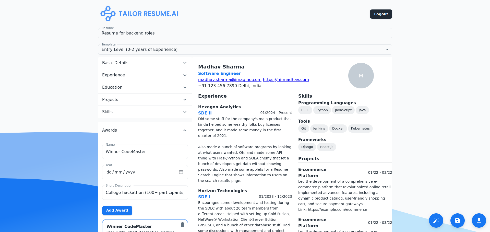
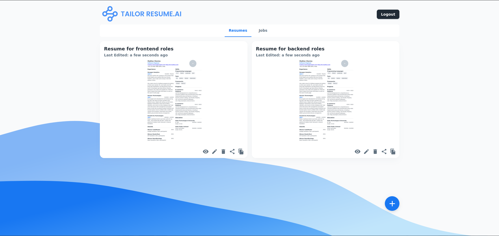
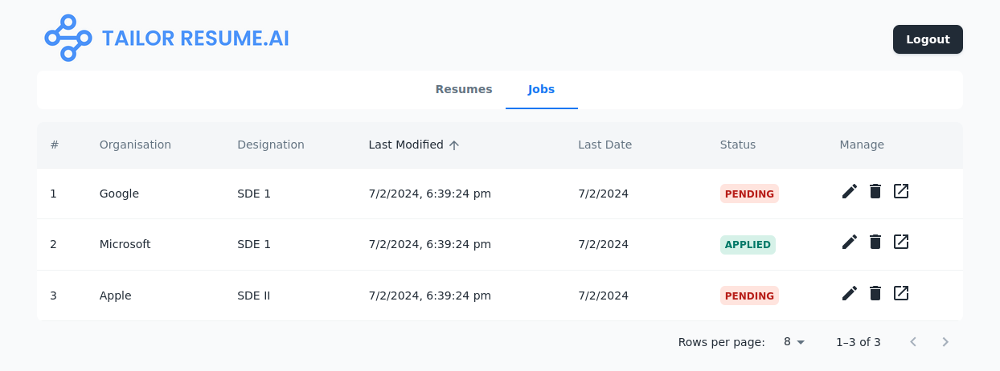
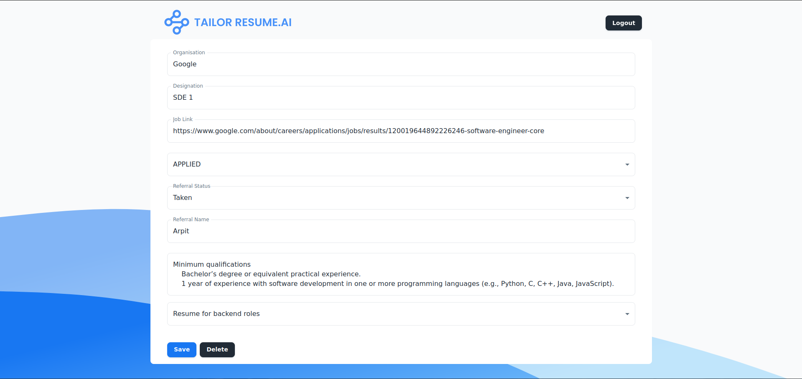
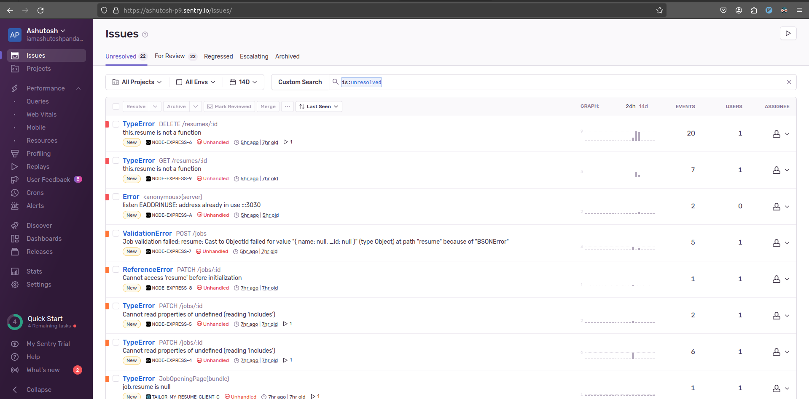
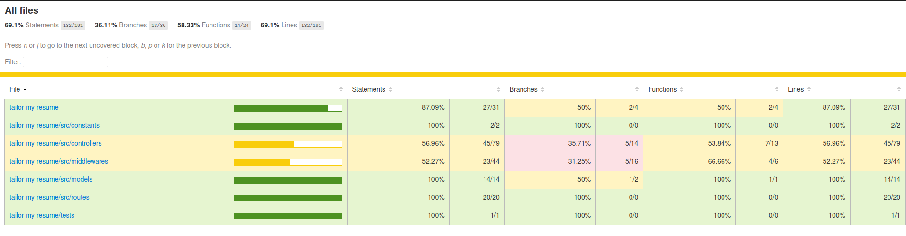
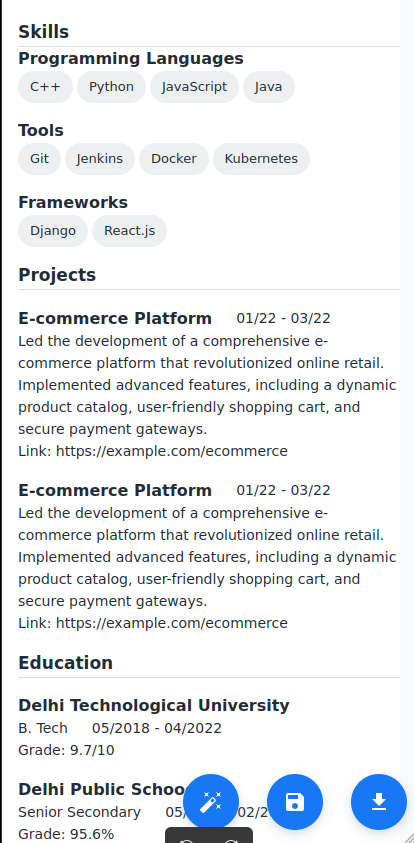
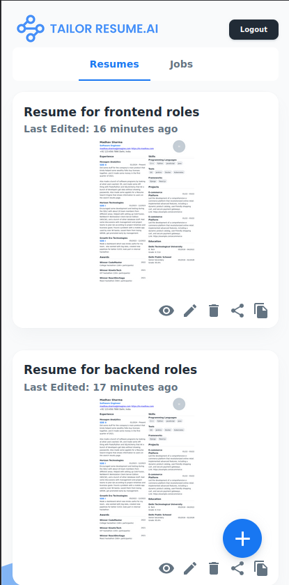

<p align="center">
  
</p>

Welcome to TailorResume.AI, your ultimate solution for creating, managing, and sharing professional resumes tailored to specific job openings. This full-stack project is built with React, Node.js with MongoDB Atlas, and incorporates various powerful technologies to streamline your job application process.

## Live Applications

- **Netlify Deployment:** [tailor-resume-ai.netlify.app](https://tailor-resume-ai.netlify.app)
- **Render.com Deployment:** [tailor-my-resume-express-backend.onrender.com](https://tailor-my-resume-express-backend.onrender.com)

## Features

1. **Create Resume:** Design and generate your professional resume using our intuitive application.
2. **Share Resume:** Share your resume with the world easily.
3. **Enhance with ChatGPT:** Utilize the power of ChatGPT to improve your resume's content.
4. **Multiple Templates:** Choose from a variety of templates for creating your resume.
5. **Download as PDF:** Download your resume in PDF format for offline use or sharing.
6. **Job Tracking:** Keep track of all the jobs you've applied for along with the respective resumes used.
7. **Usage Monitoring:** Monitor application usage with Sentry integrated for both client and backend.
8. **Token-based Auth:** We offer a token-based authentication mechanism for simplicity, including a guest login feature.
9. **Rate Limiting:** Rate limiting is enabled on our backend for enhanced security.
10. **Containerization:** Dockerfiles are provided for easy containerization of the application.
11. **Beautiful UI:** Enjoy a sleek and minimalist Material UI template for an enhanced user experience.
12. **Test Coverage:** We have about 70% unit test coverage with jest for the Express backend and around 25% coverage for the React frontend.
13. **Mobile Friendly UI**: The platform is designed to provide amazing UX in desktop and mobile both.

## Problem we want to solve

In the job application process, using the same resume for different roles may not be ideal. {project_name} addresses this issue by providing tools to create professional resumes tailored to specific job openings, along with managing multiple job applications seamlessly.

## Samples

### Resume Builder



### Use AI to improve your resume


### My Resumes page



### Job Hunting Dashboard



### Track a job



### Sentry Integration



### Test Coverage



### Mobile samples

<p align="center">
  
  
</p>

## Development

To develop locally, follow these steps:

**Backend:**

```bash
npm i
npm run dev
```

**Client:**

```bash
cd client
npm i
npm run start
```

Remember to create `.env` files as per the provided `.env.example` in both the client and root directories of the project.

## Additional Resources

- **Figma Diagrams:** [Figma Wireframe for Desktop & Mobile](https://www.figma.com/file/GxuX8FxP5UWVFho9PPrcxJ/TailorMyResume-Material-3-Design?type=design&node-id=54725%3A27727&mode=design&t=9uk293qjmVIjlVdB-1)
- **PRD Document:** [Link to PRD document](#)

## Deployment

The project is deployed on [Netlify](https://www.netlify.com/) and [Render.com](https://render.com/).

## Get Started

Start building your professional resume today with TailorResume.AI!
If you have any questions or feedback, feel free to reach out.
Happy job hunting! 🚀

_This is a hobby project created and maintained by [Ashutosh Panda](https://www.linkedin.com/in/ashutosh-panda/)._
